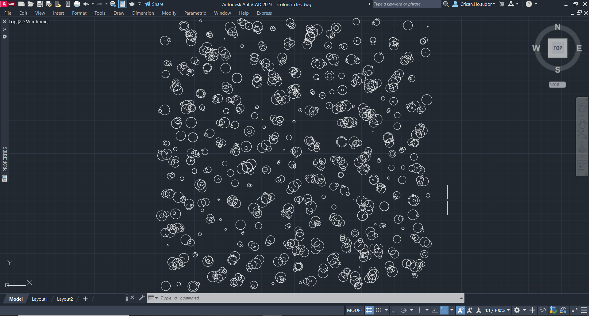
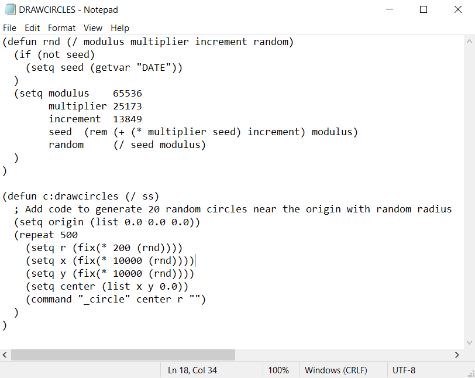

# **Proiect 2 GAC | AutoCAD - LISP** 

# Descriere:
Codul este scris în Lisp, un limbaj de programare folosit pentru aplicații de automatizare a desenelor în AutoCAD.

Funcția `rnd` generează numere pseudo-aleatoare. Are cinci variabile: `modulus`, `multiplier`, `increment`, `seed` și `random`. `modulus` este setat la 65536, `multiplier` la 25173 și `increment` la 13849. Funcția utilizează formula de generare a numerelor pseudo-aleatoare, care se bazează pe o valoare inițială a variabilei `seed` și generează o nouă valoare în fiecare apel al funcției. Valoarea întoarsă de funcție este un număr pseudo-aleator în intervalul (0,1). Totodata poate fi folosita, precrum in exemplul din cod, cu un parametru custom setat la apelarea funcției. Astfel, funcția poate fi folosită pentru a genera numere în intervalul dorit de noi.

În ultima secțiune a codului, funcția `c:drawcircles` este definită pentru a genera 500 de cercuri aleatorii în apropierea originii. În această funcție, variabila `origin` este setată la o listă care reprezintă coordonatele originii, adică (0.0, 0.0, 0.0). Prin intermediul instrucțiunii `repeat`, se vor executa următoarele instrucțiuni de mai multe ori, de 500 de ori în cazul de față. În fiecare iterație, funcția `rnd` este utilizată pentru a genera o valoare pseudo-aleatoare pentru raza cercului, cat si pentru coordonata x și coordonata y. Aceste valori sunt apoi convertite în valori întregi prin intermediul funcției `fix` și stocate în variabilele `r`, `x` și `y`. Se creează apoi o listă numită `center`, care conține coordonatele centrului cercurilor, calculate prin intermediul variabilelor `x`, `y` și o valoare constantă de 0.0. Această listă este apoi utilizată în comanda `\_circle` pentru a genera cercul cu raza `r` și centrul în poziția specificată.

În final, funcția `c:drawcircles` nu întoarce nicio valoare, ci doar generează cercuri aleatorii în apropierea originii.

# Imagini:

# Documentație:
- <https://www.cadforum.cz/en/qaID.asp?tip=1366>
- <https://help.autodesk.com/view/ACD/2023/ENU/?guid=GUID-3FCEA129-CB34-48E6-B3A2-36ADE2D3B584>
